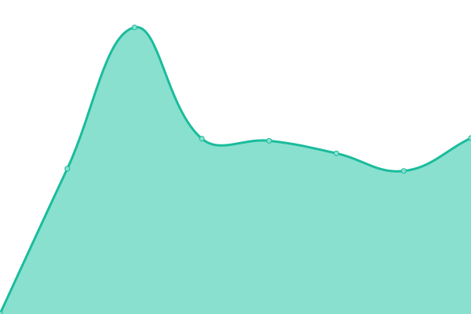

# [📈 Live Status](https://upptime.github.io/upptime): <!--live status--> **🟧 Partial outage**

This repository contains the open-source uptime monitor and status page for [Upptime](https://upptime.js.org), powered by [Upptime](https://github.com/upptime/upptime).

With [Upptime](https://upptime.js.org), you can get your own unlimited and free uptime monitor and status page, powered entirely by a GitHub repository. We use [Issues](https://github.com/upptime/upptime/issues) as incident reports, [Actions](https://github.com/whywaita/upptime/actions) as uptime monitors, and [Pages](https://upptime.github.io/upptime) for the status page.

<!--start: status pages-->
<!-- This summary is generated by Upptime (https://github.com/upptime/upptime) -->
<!-- Do not edit this manually, your changes will be overwritten -->
<!-- prettier-ignore -->
| URL | Status | History | Response Time | Uptime |
| --- | ------ | ------- | ------------- | ------ |
|  [Blog](https://blog.whywrite.it/) | 🟥 Down | [blog.yml](https://github.com/whywriteit/upptime/commits/HEAD/history/blog.yml) | 

 852ms
     
 | 

<a href="https://whywriteit.github.io/upptime/history/blog">80.73%</a>
    

|  [Mastodon](https://mstdn.uec.tokyo/about) | 🟥 Down | [mastodon.yml](https://github.com/whywriteit/upptime/commits/HEAD/history/mastodon.yml) | 

 832ms
     
 | 

<a href="https://whywriteit.github.io/upptime/history/mastodon">80.73%</a>
    

|  [Mastodon assets](https://assets.mstdn.uec.tokyo/mastodon/accounts/avatars/000/000/002/original/7c1c520de04c6952.png) | 🟩 Up | [mastodon-assets.yml](https://github.com/whywriteit/upptime/commits/HEAD/history/mastodon-assets.yml) | 

 790ms
     
 | 

<a href="https://whywriteit.github.io/upptime/history/mastodon-assets">100.00%</a>
    

|  [shokujinj API](https://api.shokujin.jp/) | 🟥 Down | [shokujinj-api.yml](https://github.com/whywriteit/upptime/commits/HEAD/history/shokujinj-api.yml) | 

 767ms
     
 | 

<a href="https://whywriteit.github.io/upptime/history/shokujinj-api">92.80%</a>
    

<!--end: status pages-->

[**Visit our status website →**](https://upptime.github.io/upptime)

## 📄 License

- Powered by: [Upptime](https://github.com/upptime/upptime)
- Code: [MIT](./LICENSE) © [Upptime](https://upptime.js.org)
- Data in the `./history` directory: [Open Database License](https://opendatacommons.org/licenses/odbl/1-0/)
